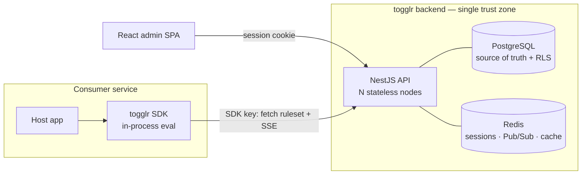

# togglr

**togglr** is a low-latency, multi-tenant feature flag platform. Organizations create feature flags, target them with complex rules (user attributes, percentage rollouts, custom segments), and toggle them in real time across their applications — with **sub-5ms in-process evaluation**, instant propagation of changes, tenant-isolated data, telemetry, and full audit history with one-click rollback.

> **Status:** design & specification phase. The architecture, data model, and API contract are settled and documented under [`docs/`](docs/); implementation is tracked as epics under [`tasks/epics/`](tasks/epics/). No application code has shipped yet — this repository currently holds the specs, design docs, and ADRs that define what gets built.

## Why togglr

Teams ship continuously but want to expose changes gradually — and kill a bad change **instantly**, without a redeploy. Rolling your own flag system is hard to get right:

- **Latency** — naive systems call a flag service on every check, adding 10–50ms+ per hot path. togglr evaluates **locally, in-process**, in under 5ms.
- **Staleness** — polling lets a killed flag linger for seconds to minutes. togglr propagates changes to connected SDKs in **under a second**.
- **Isolation** — a shared multi-tenant service must guarantee one customer can never see another's data. togglr enforces this in the database with **PostgreSQL row-level security**.
- **Auditability** — flag changes are production changes. togglr records **every mutation** (actor + before/after) and supports **one-click rollback**.

## Surfaces

togglr ships three surfaces:

- **Platform API** — a NestJS service where organizations sign up and manage projects, environments, flags, and rules. Backed by PostgreSQL (source of truth, RLS for tenant isolation), Redis (Pub/Sub fan-out + cache + session store), and Server-Sent Events for real-time streaming.
- **Web app** — a React single-page admin dashboard (Vite + React Router + TanStack Query, Tailwind + shadcn/ui) for managing orgs, projects, environments, flags, and audit history. A pure client of the Platform API, authenticated via httpOnly, Redis-backed session cookies. Dogfoods the real-time stream.
- **Client SDK** — a first-party server-side TypeScript library consumer services install to evaluate flags **locally** (streaming the ruleset in-process) and stay fresh via a live SSE connection.

## Architecture



Key design decisions:

- **Local evaluation ("Model B").** The SDK downloads an environment's full **ruleset** once, caches it in memory, and evaluates flags in-process — no per-check network call. This is what makes sub-5ms real.
- **Pure evaluation engine (`eval-core`).** A shared, I/O-free package computes `(ruleset, context) → result`. The SDK and the API's server-side preview run the **identical** engine, so results never diverge. It never throws into the host.
- **Real-time transport.** Changes propagate over **Server-Sent Events** to clients, fanned out across stateless API nodes via **Redis Pub/Sub**; **polling remains the fallback**. Correctness never depends on delivery — every ruleset carries a monotonic version and clients version-check on reconnect.
- **Tenant isolation.** Every tenant-scoped table carries `organization_id` under a **row-level-security** policy keyed on a per-transaction `SET LOCAL app.current_org`. The API connects as a non-privileged, non-`BYPASSRLS` role and refuses to boot if RLS isn't active.
- **Auth.** Browser → API via httpOnly, Redis-backed session cookies (SameSite + CSRF). SDK → API via per-environment secret keys (hashed at rest, rotatable, revocable).

New to the domain? Start with the [**Glossary**](docs/glossary.md).

## SDK usage (target API)

```ts
import { Togglr } from '@togglr/sdk';

const togglr = new Togglr({ sdkKey: process.env.TOGGLR_SDK_KEY! });
await togglr.waitForReady();                       // optional; never required

// evaluate(flagKey, context, defaultValue) — returns the caller default until ready
const on = togglr.evaluate('new-checkout-ui', { key: userId, plan }, false);
if (on) renderNewCheckout();
```

`evaluate()` never throws and returns your supplied default for any non-resolvable case (not yet bootstrapped, unknown flag, missing bucketing key). See [Ruleset & Evaluation Engine + SDK](docs/design/ruleset-evaluation-sdk.md).

## Planned repository layout

togglr will be a **pnpm-workspaces monorepo** (per [`AGENTS.md`](AGENTS.md)):

```
apps/
  api/              # NestJS Platform API
  web/              # React admin SPA (Vite)
packages/
  sdk/              # server-side client SDK
  eval-core/        # pure, I/O-free evaluation engine
  shared-types/     # ruleset shape, evaluation-context, version types, DTOs
```

The engine lives in its own package so both `api` and `sdk` depend on it without `api → sdk`; the three surfaces meet only at the `shared-types` wire contract.

## Tech stack

| Concern | Choice |
| --- | --- |
| Language | TypeScript (strict), across API, web, and SDK |
| API framework | NestJS |
| Web app | React SPA — Vite, React Router, TanStack Query, Tailwind + shadcn/ui (no SSR) |
| Datastore | PostgreSQL (primary, RLS) + Redis (Pub/Sub, cache, sessions) |
| Real-time | Server-Sent Events (client), Redis Pub/Sub (internal fan-out), polling fallback |
| Persistence tooling | Kysely (typed query builder — [ADR](docs/design/adr-persistence-tooling.md)) |
| Lint / format | Biome (single source of truth — no ESLint/Prettier) |
| Package manager | pnpm (workspaces) |

## Delivery phases

| Phase | Focus |
| --- | --- |
| 1 — Foundation | Org/project/environment management, auth & sessions, RLS tenant isolation, flag authoring, local-eval SDK with polling, admin web app |
| 2 — Real-time | SSE push + Redis fan-out; SDK streaming refresh (polling demoted to fallback) |
| 3 — Telemetry | SDK emission seam → ingest → dashboards |
| 4 — Audit & segments | Version-history UI + one-click rollback; reusable segments + expanded operators |

## Documentation

- [`docs/specs/`](docs/specs/) — product specification / PRD ([platform spec](docs/specs/togglr-platform.md))
- [`docs/design/`](docs/design/) — technical design docs and ADRs:
  - [Architecture Overview](docs/design/architecture-overview.md)
  - [Control Plane & Data Model](docs/design/control-plane-data-model.md)
  - [Ruleset & Evaluation Engine + SDK](docs/design/ruleset-evaluation-sdk.md)
  - ADRs: [RLS tenant isolation](docs/design/adr-rls-tenant-isolation.md) · [Real-time transport](docs/design/adr-realtime-transport.md) · [Persistence tooling](docs/design/adr-persistence-tooling.md)
- [`docs/api/`](docs/api/) — [API contract](docs/api/togglr-api.md)
- [`docs/glossary.md`](docs/glossary.md) — domain terms and abbreviations
- [`tasks/epics/`](tasks/epics/), [`tasks/stories/`](tasks/stories/) — implementation breakdown

## License

[Apache License 2.0](LICENSE).
