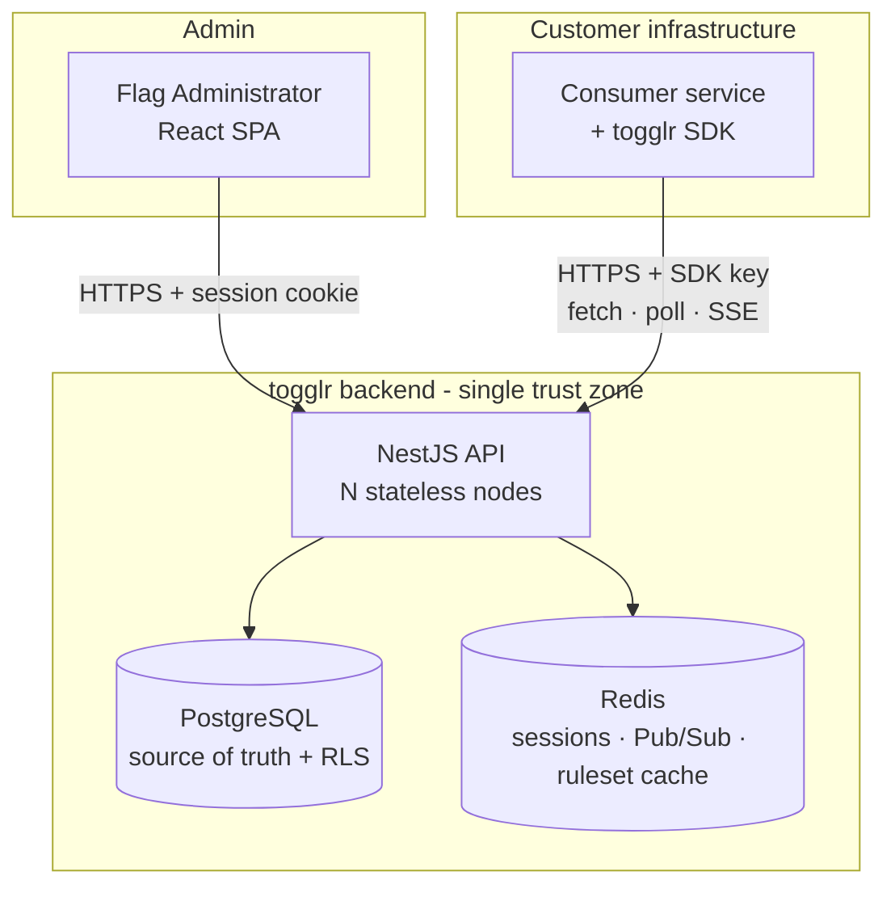
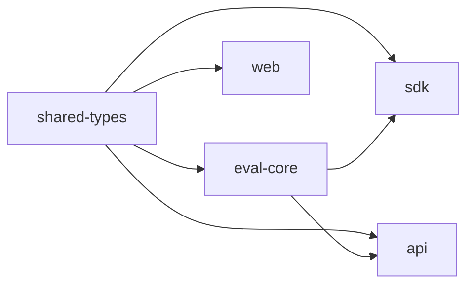
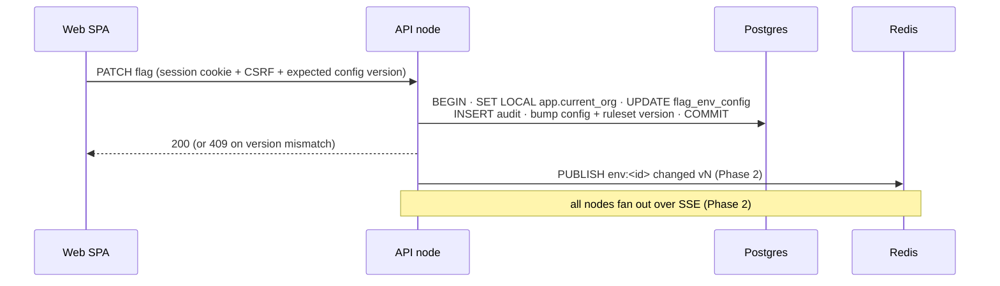
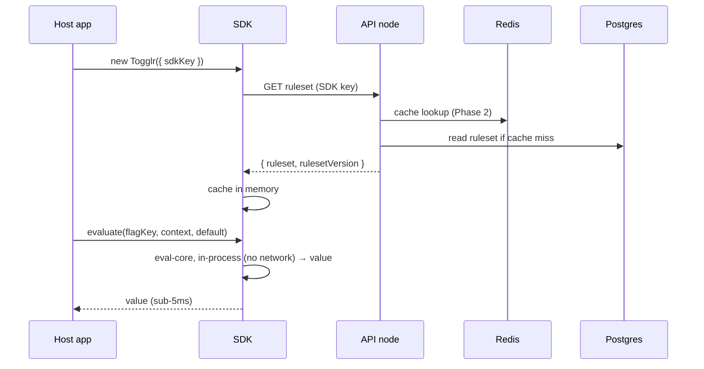
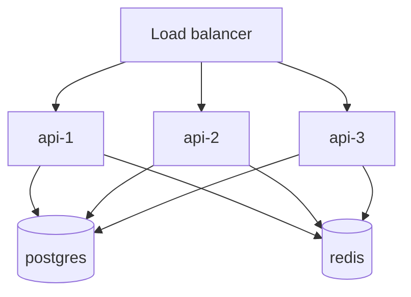

# togglr — System Architecture Overview

## Overview

This document is the system-level map for togglr: the components, the boundaries
between them, and the cross-cutting contracts every other design doc inherits. It spans
the full product vision (all four phases) so the architecture is stable as later phases
land, but goes deep only where Phase 1 builds now. Subsystem detail lives in two seam
docs — [Control Plane & Data Model](control-plane-data-model.md) (the write side +
tenant isolation) and [Ruleset & Evaluation Engine + SDK](ruleset-evaluation-sdk.md)
(the hot path) — and the load-bearing, reversible decisions live in ADRs referenced
throughout.

togglr is one NestJS API backed by PostgreSQL (source of truth, tenant-isolated by
row-level security) and Redis (session store, Pub/Sub fan-out, ruleset cache),
consumed by two clients: a React SPA admin dashboard and a server-side TypeScript SDK
that evaluates flags **locally, in-process**.

## Goals & Non-Goals

### Goals
- A single map that fixes component boundaries and the contracts spanning them
  (tenant isolation, version model, `eval-core` boundary, real-time transport, auth).
- Make the headline properties structurally true, not aspirational: sub-5ms eval
  (local, I/O-free engine), <1s propagation (SSE + Redis fan-out), zero cross-tenant
  access (Postgres RLS), consumer resilience (last-known ruleset + never-throw).
- Design for horizontal scale (N stateless API nodes) from day one, even though the
  demo runs via docker-compose.

### Non-Goals
- Subsystem-level detail (schema DDL, engine algorithm, SDK runtime internals) — those
  live in the two seam docs.
- Re-deciding what the spec settled (local eval / Model B, SSE primary transport,
  server-side SDK only, single-region). This doc records how, not whether.
- Production infra hardening (secrets management, autoscaling policy, multi-region) —
  deferred; the architecture must not preclude it.

## Current State

Greenfield. The repo holds the spec, ten epics, and the omp framework — no application
code yet. Platform Foundation stands up the monorepo shells this design populates.

## System Context

Two clients, two auth mechanisms (see Auth below). Postgres and Redis are internal;
neither client ever connects to them directly.

## Component Architecture

Monorepo (pnpm workspaces), TypeScript strict, Biome as the single lint/format tool.

| Package | Kind | Responsibility |
| --- | --- | --- |
| `apps/api` | NestJS service | All domain logic: auth, orgs/projects/envs, flags/rules/rollouts, ruleset delivery, SDK-key validation, telemetry ingest, SSE, audit. The only writer to Postgres/Redis. |
| `apps/web` | React SPA | Admin dashboard. Pure client (no SSR, no BFF) — Vite, React Router, TanStack Query, Tailwind + shadcn/ui. |
| `packages/sdk` | Library | Server-side SDK: bootstrap, in-memory cache, refresh (poll → SSE), resilience, telemetry seam. Owns everything *except* the evaluation algorithm. |
| `packages/eval-core` | Library | The **pure, I/O-free evaluation engine**: `(ruleset, context) → variation`. Consumed by both the SDK and the API's server-side preview so they can never diverge. |
| `packages/shared-types` | Library | The wire contracts shared by all three: DTOs, the **ruleset shape**, evaluation-context type, and the **version** types. |

**Dependency direction (must stay acyclic):**

`eval-core` and `shared-types` are leaves depended on by API, SDK, and web. The API
never depends on the SDK, and the SDK never depends on the API — they meet only at the
`shared-types` wire contract. This is why the engine lives in its own package rather
than inside `packages/sdk` (which would force `api → sdk`).

## Cross-Cutting Contracts

These are the seams that, if left implicit, cause the subsystem designs to collide.
Each is fixed here once.

### 1. Tenant isolation (Postgres RLS) — see [ADR: RLS tenant isolation](adr-rls-tenant-isolation.md)

Every tenant-scoped table carries `organization_id`. The API connects as a
**non-privileged, non-`BYPASSRLS` role**; each request runs inside a transaction that
first issues `SET LOCAL app.current_org = $orgId`, and RLS policies restrict every row
to `current_setting('app.current_org')`. `SET LOCAL` is transaction-scoped, so a pooled
connection cannot leak context into the next request. Application code physically
cannot read another tenant's rows even if a `WHERE organization_id = …` is forgotten —
the database is the backstop. Proven by tests that reuse a pooled connection across two
orgs and assert zero cross-tenant rows.

### 2. Version model (two distinct concepts)

The word "version" means two different things; conflating them thrashes the design.

| Concept | Scope | Monotonic? | Drives |
| --- | --- | --- | --- |
| **Config version** | per (flag, environment) | bumped per flag-env write | Optimistic-concurrency 409s in Flag Authoring |
| **Ruleset version** | per environment | monotonically increasing on *any* change in the env | SDK freshness/version-check, the Real-Time signal payload, and the stamp on telemetry events |

Ruleset version is a **per-environment integer counter** (simple, cheaply comparable,
human-readable in logs; ULIDs were considered — see the Ruleset seam doc). A flag write
bumps that flag's per-environment config version *and* the environment ruleset version in
the same transaction. Because ruleset version is a single per-environment row, concurrent
writes within one environment serialize on it — an accepted tradeoff at portfolio scale
(detailed in the Control Plane doc).

### 3. `eval-core` boundary

Evaluation is a pure function `(ruleset, context) → EvaluationResult` with no I/O. The
identical engine runs in the SDK (hot path) and in the API (server-side preview/
debugger). Neither the SDK's caching/refresh nor the API's persistence leak into it.
This is what makes sub-5ms trivial and lets the engine be exhaustively unit-tested in
isolation. Detailed in the Ruleset seam doc.

### 4. Real-time transport — see [ADR: real-time transport](adr-realtime-transport.md)

SDK/browser freshness is delivered over **Server-Sent Events** (one-way server→client,
native auto-reconnect, plain HTTP). Cross-node fan-out uses **Redis Pub/Sub**: the node
that persists a change `PUBLISH`es `env:<id> changed vN`; all nodes hold a standing
subscription and push over their own SSE streams. Pub/Sub is fire-and-forget, so the
**ruleset-version check on (re)connect** is the correctness backstop; **polling** is
the fallback when an intermediary blocks SSE. Phase 1 ships polling only; SSE + Pub/Sub
land in Phase 2. The endpoints and payloads are designed now so Phase 1 is
forward-compatible.

### 5. Authentication (two mechanisms, matched to threat models)

- **Browser → API:** httpOnly + Secure + `SameSite` session cookie, backed by a
  **server-side session in Redis** (instant revocation), CSRF token on mutations. Token
  never reaches JavaScript.
- **SDK → API:** **per-environment secret key**, scoped to one environment's ruleset,
  rotatable with a grace window, revocable. Validated by a guard owned by Org Workspace
  and consumed by Ruleset Delivery, Real-Time, and Telemetry.

Authorization in v1 is coarse org roles (owner/admin/member); every request is
org-scoped and RLS-enforced regardless of role.

Abuse controls (login brute-force throttling, per-SDK-key/endpoint rate limiting) are
deferred with production hardening — not built in Phase 1, but the single API ingress
does not preclude adding them later.

## Key Data Flows

### Write path (admin toggles a flag)

### Read path (SDK bootstrap + evaluate)

Freshness: Phase 1 the SDK polls `GET version`; if newer, refetch. Phase 2 an SSE push
triggers the same refetch, polling stays as fallback. During an outage the SDK serves
its last-known ruleset and never throws.

## Deployment Topology

Local `docker-compose`: `postgres`, `redis`, `api` (scalable to N replicas), `web`
(static assets). The API is **stateless** — all state is in Postgres/Redis — so
`docker compose up --scale api=3` behind a simple load balancer exercises the exact
cross-node fan-out problem Redis Pub/Sub solves (an admin write lands on one node; SDK
SSE streams are pinned to others). This keeps the multi-node story real and
demonstrable without a cloud account, while not precluding a later Fly/Render/AWS
deploy.

## Non-Functional Targets

| Property | Target | How the architecture delivers it |
| --- | --- | --- |
| SDK `evaluate()` p99 | < 5 ms | Local, I/O-free `eval-core`; ruleset cached in host memory |
| Propagation (toggle → SDK serves new value) | < 1 s p95 (Phase 2) | SSE push + Redis fan-out; version-check backstop |
| Cross-tenant access | 0 | Postgres RLS + `SET LOCAL` per request; isolation tests |
| Concurrent SDK connections (portfolio target) | ~1k | Stateless nodes; SSE is cheap; Redis-backed ruleset cache |
| Eval throughput | ~10k evals/sec (unbounded in principle) | Evaluation is local; API load scales with SDK count, not eval count |
| SDK behavior when API is down | No throw; serves last-known | In-memory cache + never-throw `evaluate` contract |
| Telemetry added host latency | ~0 | Async, batched, fire-and-forget off the hot path |

**Validation:** the `evaluate()` p99 target is proven in Phase 1 by an `eval-core`
micro-benchmark (pure function, no infra) as an acceptance gate. Propagation, concurrent
connections, and throughput targets are validated in Phase 2 by an N-connection load
test, once SSE exists to make them measurable; through Phase 1 they remain design targets.

## Technology Choices

- **API:** NestJS (modular DI, guards/interceptors fit the auth + org-context +
  RLS-transaction cross-cutting concerns cleanly).
- **Persistence/query + migrations:** Kysely — see
  [ADR: persistence tooling](adr-persistence-tooling.md). Chosen for first-class
  transaction control and raw `SET LOCAL`, which the RLS approach requires.
- **Datastore:** PostgreSQL (RLS) + Redis (sessions, Pub/Sub, cache).
- **Web:** React SPA (Vite, React Router, TanStack Query, Tailwind + shadcn/ui).
- **Transport:** SSE (primary, Phase 2) + Redis Pub/Sub (internal) + polling (fallback/
  Phase 1).
- **Tooling:** pnpm workspaces, Biome, TypeScript strict; test framework and CI settled
  in the Control Plane doc / Foundation epic.

## Phase → Component Map

| Phase | Epics | Touches |
| --- | --- | --- |
| 1 — MVP | Platform Foundation, Auth & Sessions, Org Workspace & Isolation, Flag Authoring, Ruleset Delivery & Contract, Local-Evaluation SDK | All packages; RLS; polling refresh |
| 2 — Real-time | Real-Time Propagation | SSE endpoint, Redis Pub/Sub + ruleset cache; SDK switches to streaming; SPA dogfoods SSE |
| 3 — Telemetry | Telemetry & Analytics | SDK emission seam → ingest → Postgres rollups → dashboards |
| 4 — Audit/segments | Audit & Rollback, Segments & Advanced Targeting | Version-history UI + rollback; reusable segments + expanded operators (in `eval-core`) |

## Cross-Cutting Failure Modes

| Failure | Impact | Mitigation |
| --- | --- | --- |
| Redis down | No real-time fan-out; no session lookups | Postgres is source of truth; SDKs fall back to polling + version check (degraded, not broken). Session dependency on Redis is a known single point for the admin surface — acceptable for v1, noted for later HA. |
| Postgres down | No writes, no cache-miss reads | SDKs keep serving last-known ruleset; admin surface returns errors (fail-closed on writes). |
| API node dies | Its SSE streams drop | SDKs reconnect to another node; version check heals missed changes. |
| RLS policy gap | Cross-tenant leak (worst case) | RLS on every tenant table + non-BYPASSRLS role + pooled-connection isolation tests + review checklist. |
| SSE blocked by proxy | No live updates for that consumer | Polling fallback + heartbeats + documented network requirements. |

## Open Questions

- [ ] Load-balancer choice for the multi-node compose demo (nginx vs Traefik) — cosmetic
      for the architecture; pick in the Foundation epic.
