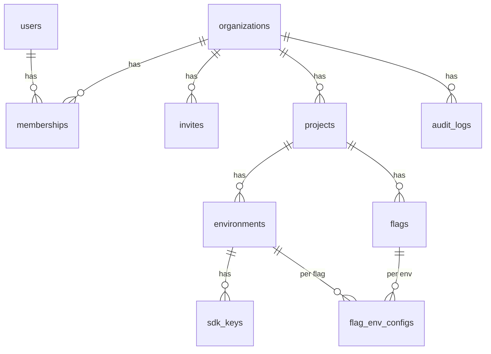
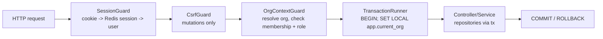

# togglr — Control Plane & Data Model (Phase 1)

## Overview

The control plane is the write side of togglr: the NestJS API, the PostgreSQL schema,
tenant isolation, session auth, org/project/environment management, SDK keys, and flag
authoring (create/edit/toggle flags, rules, rollouts). It produces the config that the
[Ruleset & Evaluation Engine + SDK](ruleset-evaluation-sdk.md) doc serves to consumers.
It realizes the Phase-1 epics: Platform Foundation (backend), Auth & Sessions, Org
Workspace & Isolation, and Flag Authoring (write side + preview).

## Goals & Non-Goals

### Goals
- A Postgres schema for the full domain model (org → project → environment → flag →
  rule/rollout), tenant-isolated by RLS.
- A request lifecycle that authenticates, authorizes by role, sets tenant context, and
  runs all tenant data access inside an RLS-scoped transaction.
- Secure browser sessions (Redis-backed, httpOnly, CSRF) and per-environment SDK keys
  (hashed at rest, rotatable, validated by a shared guard).
- Optimistic concurrency for flag edits and a monotonic per-environment ruleset version
  bumped on every change.

### Non-Goals
- Ruleset serialization shape, the fetch endpoint, and the evaluation algorithm (hot-path
  doc).
- Real-time push (Phase 2), telemetry (Phase 3), audit-history UI + rollback (Phase 4;
  audit *records* are written here from day one).
- SSO, fine-grained permissions, billing (spec non-goals).

## Current State

Greenfield; Platform Foundation provides the empty NestJS app, docker-compose
(Postgres + Redis), Kysely wiring, and CI.

## Data Model

All tenant-scoped tables carry `organization_id uuid not null` and an RLS policy (see
Tenant Isolation). `users` is the only global (non-tenant) table — an identity can
belong to multiple orgs via `memberships`.



| Table | Key columns | Notes |
| --- | --- | --- |
| `users` | `id`, `email` unique, `password_hash`, `created_at` | Global identity. Not tenant-scoped. |
| `organizations` | `id`, `name`, `slug` unique, `created_at` | The tenant boundary. RLS: `id = current_org`. |
| `memberships` | `id`, `organization_id`, `user_id`, `role` (`owner`\|`admin`\|`member`), `created_at` | Unique (`organization_id`,`user_id`). Gates access + role. |
| `invites` | `id`, `organization_id`, `email`, `role`, `token_hash`, `status` (`pending`\|`accepted`\|`expired`), `expires_at`, `invited_by`, `created_at` | Email invite; token stored hashed. |
| `projects` | `id`, `organization_id`, `key`, `name`, `created_at` | Unique (`organization_id`,`key`). |
| `environments` | `id`, `organization_id`, `project_id`, `key`, `name`, `ruleset_version bigint not null default 0`, `created_at` | **`ruleset_version`** = per-env monotonic counter. |
| `sdk_keys` | `id`, `organization_id`, `environment_id`, `prefix`, `key_hash`, `status` (`active`\|`revoked`), `expires_at` (nullable, for rotation grace), `last_used_at`, `created_at` | Secret shown once; only hash stored. |
| `flags` | `id`, `organization_id`, `project_id`, `key`, `description`, `type` (`boolean` MVP), `archived_at` (nullable), `created_at` | Unique (`organization_id`,`project_id`,`key`). Definition lives at project scope. |
| `flag_env_configs` | `id`, `organization_id`, `flag_id`, `environment_id`, `enabled bool`, `default_variation jsonb`, `rules jsonb not null default '[]'`, `config_version int not null default 0`, `updated_at` | Per-(flag,environment) state. **`rules`** = ordered array `[{conditions:[{attribute,operator,values[]}], result}]`, where `result` is a variation or `{percentage, bucketBy, variation}` — the exact shape `eval-core` consumes. **`config_version`** drives optimistic concurrency. Unique (`flag_id`,`environment_id`). |
| `audit_logs` | `id`, `organization_id`, `actor_user_id`, `action`, `target_type`, `target_id`, `environment_id`, `before jsonb`, `after jsonb`, `created_at` | Append-only, enforced by `REVOKE UPDATE, DELETE ON audit_logs FROM togglr_app` (structural, not convention). Surfaced in Phase 4. |

Sessions are **not** in Postgres — they live in Redis (see Auth).

## Tenant Isolation (applying the RLS ADR)

Mechanism per [ADR: RLS tenant isolation](adr-rls-tenant-isolation.md):

- Migrations (privileged role) enable RLS and create a policy on every tenant table:
  ```sql
  ALTER TABLE projects ENABLE ROW LEVEL SECURITY;
  CREATE POLICY tenant_isolation ON projects FOR ALL
    USING (organization_id = current_setting('app.current_org', true)::uuid)
    WITH CHECK (organization_id = current_setting('app.current_org', true)::uuid);
  ```
  (`organizations` uses `id = current_setting('app.current_org', true)::uuid`.) The `true`
  (missing_ok) makes an unset context read as NULL, so a missing preamble yields 0 rows
  rather than erroring — the fail-closed behavior the tests and error table rely on.
- The API connects as role `togglr_app` — **not** superuser, **not** `BYPASSRLS`.
- A `TransactionRunner` (NestJS interceptor + AsyncLocalStorage) opens a transaction per
  tenant request, runs `SET LOCAL app.current_org = $orgId`, exposes the transaction
  handle to repositories, and commits/rolls back. Because `SET LOCAL` is
  transaction-scoped, a pooled connection carries no context into the next request.
- **Startup assertion:** the API verifies at boot that its DB role is not a superuser and
  that RLS is active on a probe table; it refuses to start otherwise.

**Bootstrap paths without an org context** (sign-up, login, org creation, invite lookup by
token, SDK-key validation) operate on the global `users` table or resolve the org *before*
setting context. Org creation sets `app.current_org` to the freshly generated org id inside
the same transaction so the `WITH CHECK` on the initial `INSERT`s passes.

## Request Lifecycle



SDK requests (ruleset fetch, later SSE/telemetry) swap `SessionGuard`+`CsrfGuard` for the
**`SdkKeyGuard`**, which resolves the environment/org from the key, then use the same
`TransactionRunner`. A global exception filter guarantees no internal error escapes as a
tenant-data leak and that domain errors map to correct status codes.

## Components

### AuthModule (Auth & Sessions)
- **Sign-up / login:** email + password. Passwords hashed with **argon2id** (memory-hard;
  bcrypt as the fallback if argon2 native build is a problem).
- **Sessions:** on login, mint a 256-bit random opaque token; store
  `session:<token> → {userId, csrfToken, createdAt, lastSeenAt}` in Redis with an **idle
  TTL of 30 min** (refreshed on activity) and a **12 h absolute lifetime** cap. Set it as
  an `httpOnly; Secure; SameSite=Lax` cookie. The token never reaches JS.
- **CSRF:** a per-session CSRF token returned to the SPA (readable, non-httpOnly) and
  required as a header on all mutating requests; compared against the session record.
  `SameSite=Lax` is defense-in-depth, the token is the primary control.
- **Revocation:** logout deletes the session key; "revoke all" deletes all of a user's
  sessions (tracked via a `user_sessions:<userId>` set). Instant because lookups are
  server-side. The set is pruned on logout and validated on read — members whose
  `session:<token>` has already lapsed via idle TTL are dropped — so it never accumulates
  dead tokens.
- **Invite-accept hook:** validates an invite token, creates/links the `users` row, and
  hands off to Org Workspace to create the membership.
- **Email verification:** deferred for MVP — invite emails are already trusted, so sign-up
  creates an active account directly. Invite email is delivered locally via **Mailhog** in
  docker-compose.
- **Password reset:** deferred for MVP alongside email verification (portfolio scope). The
  Mailhog + hashed-token machinery used for invites makes an email-based reset a
  straightforward later addition; until then an owner can re-invite a locked-out member.

### OrgModule (Org Workspace & Isolation)
- CRUD for organizations, projects, environments; membership + role management.
- **Roles:** `owner` > `admin` > `member`. A `RolesGuard` gates management actions
  (member = read + evaluate config; admin = author flags + manage env/keys; owner = manage
  org + members + billing-later). Enforced *in addition to* RLS.
- **Invites:** create invite (email + role + hashed token + expiry) → email link →
  accept (AuthModule) → membership. Pending/expired states; re-send regenerates the token.
- **SDK keys:** issue per environment — return the plaintext `tgl_<envPrefix>_<random>`
  **once**, store `prefix` + `key_hash` (SHA-256). **Validation guard** (`SdkKeyGuard`,
  consumed by other epics): hash the presented key, look up by `prefix`+`key_hash`, require
  `status=active` and (`expires_at IS NULL OR expires_at > now()`); update `last_used_at`.
  **Rotation with grace:** issuing a new key sets the old key's `expires_at = now() +
  grace` (**default 24 h, configurable**), so both authenticate during the window; after
  it, the old key is denied.
- **Environment model:** user-defined environments (not a fixed dev/staging/prod set), each
  with its own key namespace and ruleset version.

### FlagModule (Flag Authoring — write side)
- CRUD for flags (project scope; **flag `key` is immutable after creation**, pattern
  `^[a-z0-9-]+$`) and per-environment config (`flag_env_configs`). Rules live in the
  `rules` JSONB column as an ordered array, so a rule edit is just an update of that column
  on the same row. MVP operators `equals`/`not-equals`/`in`/`not-in`; percentage rollout
  with `bucketBy` (default context `key`; missing key ⇒ excluded ⇒ served the flag default).
- **Optimistic concurrency:** every mutating request carries the expected
  `config_version`. The write is `UPDATE flag_env_configs SET …, config_version =
  config_version + 1 WHERE id = $id AND config_version = $expected`; **0 rows affected ⇒
  409 Conflict** and the client refetches. Because rules are a column on this row, the
  config version covers rule edits too.
- **Ruleset version bump:** the same transaction runs `UPDATE environments SET
  ruleset_version = ruleset_version + 1 WHERE id = $envId`. This is the single serialization
  point per environment (accepted tradeoff — see overview).
- **Audit write:** the same transaction inserts an `audit_logs` row with actor, action,
  target, and before/after JSON snapshots.
- **Server-side preview:** a read-only endpoint that runs `eval-core` (hot-path doc) over a
  draft config + admin-supplied context, returning the variation — identical result to what
  the SDK would compute.

All three writes (config, ruleset version, audit) share **one transaction**, so a flag
edit is atomic: either the change, its version bumps, and its audit record all land, or
none do.

## Error Handling & Failure Modes

| Scenario | Impact | Handling |
| --- | --- | --- |
| Missing/invalid session | Request unauthenticated | 401; no org context set |
| Missing/failed CSRF token on mutation | Possible forgery | 403; mutation rejected |
| User not a member of target org | Cross-tenant attempt | 403 at OrgContextGuard; RLS would also yield 0 rows |
| Stale `config_version` on edit | Concurrent edit / rollback happened | 409; client refetches and retries |
| Data access outside TransactionRunner | No org context | RLS yields 0 rows (fails closed); caught in review + tests |
| Redis down | No session lookups | Admin surface 503 (documented v1 limitation); SDK read path unaffected |
| Postgres down | No writes | 503 on writes; fail-closed |
| App connects as privileged role | RLS bypass risk | Startup assertion refuses to boot |

## Security Considerations

- **Tenant isolation:** DB-enforced (RLS) + role/membership checks; defense in depth.
- **Session theft:** httpOnly + Secure + SameSite cookie (no token in JS), CSRF token on
  mutations, idle + absolute expiry, instant server-side revocation.
- **SDK keys:** stored only as SHA-256 hashes + prefix; shown once; scoped to one
  environment; rotatable/revocable. A leaked key exposes only that environment's ruleset
  (spec-accepted for a server-side SDK).
- **Password storage:** argon2id with per-user salt.
- **Audit:** every mutation records actor + before/after, append-only.

## Testing Strategy

- **RLS isolation (critical):** integration test with two orgs sharing the pool — set
  context to org A, confirm org B's rows are invisible; **reuse the same pooled
  connection** for an org-B request and assert no leakage. Also assert a query run with no
  context returns 0 rows.
- **Optimistic concurrency:** concurrent edits — second stale write gets 409.
- **SDK-key lifecycle:** issue/validate/revoke; rotation window authenticates both keys,
  denies the old key after expiry.
- **Auth:** session revocation denies subsequent requests immediately; missing CSRF token
  rejected; cookie flags present.
- **Atomicity:** a forced failure mid-transaction rolls back config + version bump + audit
  together (no partial writes).
- Unit tests for role gating and rule/rollout persistence.

## Rollout Plan

- Kysely migrations run as the privileged role in CI/boot; the API runs as `togglr_app`.
- Seed script: a demo org/project/envs/flags for local dev and the SDK smoke test.
- No production infra in Phase 1 (docker-compose only); feature-flagging togglr with
  itself is a later, delightful option.

## Confirmed Defaults

Recorded from design review (previously open):

- Sessions: **30 min idle**, **12 h absolute** lifetime.
- Sign-up email verification: **deferred** for MVP (invites carry a trusted email).
- Password reset: **deferred** for MVP (reuses the invite email/token machinery when added).
- Invite email delivery in dev: **Mailhog** in docker-compose.
- SDK-key rotation grace window: **24 h**, configurable.
- Flag keys: **immutable** after creation, pattern `^[a-z0-9-]+$`.
- Rule storage: **JSONB** array on `flag_env_configs` (revisit only if cross-flag rule
  analytics is ever needed).

## Open Questions

- [ ] Delete vs archive semantics for a flag still referenced by live SDKs — lean archive
  (`archived_at`); an archived/deleted key returns the caller `defaultValue` in the SDK.
