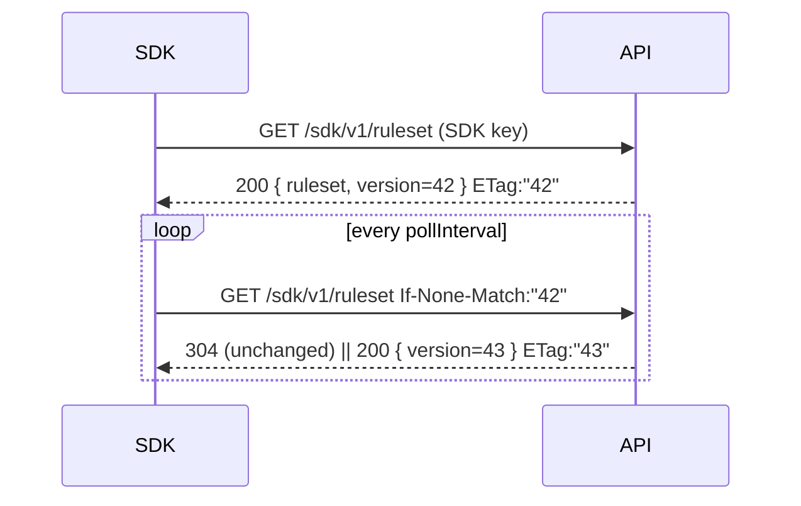

# togglr — Ruleset & Evaluation Engine + SDK (Phase 1)

## Overview

The hot path: the wire contract that describes an environment's flags (the **ruleset
shape**), the pure engine that turns `(ruleset, context)` into a value (**`eval-core`**),
and the **server-side SDK** that fetches/caches a ruleset and evaluates flags in-process
in under 5ms. This is the proof of the headline claim and the half a consumer installs.
It realizes the Ruleset Delivery & Contract and Local-Evaluation SDK epics, and supplies
the engine that Flag Authoring's preview reuses.

## Goals & Non-Goals

### Goals
- A single, serializable ruleset shape in `packages/shared-types` consumed **identically**
  by the SDK and the API preview.
- A pure, I/O-free `eval-core` with deterministic, sticky percentage bucketing.
- A `evaluate()` contract that **never throws** into the host and returns the caller's
  default for every non-resolvable case.
- An SDK that bootstraps non-blocking, refreshes by polling with a version check, serves
  last-known during outages, and carries a no-op telemetry seam for Phase 3.
- A micro-benchmark proving p99 `evaluate()` < 5ms as a Phase-1 acceptance gate.

### Non-Goals
- SSE streaming refresh (Phase 2 swaps the primary refresh; polling stays as fallback).
- Telemetry wiring (Phase 3) — only the emission seam exists here.
- Multivariate variations, segments, expanded operators (later phases) — the shape is
  designed to admit them without a breaking change.
- The write side, persistence, and RLS (control-plane doc).

## Current State

Greenfield; Platform Foundation scaffolds `packages/eval-core`, `packages/sdk`, and the
ruleset/version/context types in `packages/shared-types`.

## Ruleset Contract (`packages/shared-types`)

The canonical shape the API serves and both the SDK and preview consume. Boolean-only in
MVP; `Variation` and `RuleResult` are unions so multivariate slots in later without a
breaking change.

```ts
type Variation = boolean;                    // MVP; later: boolean | string | JsonValue

interface Ruleset {
  environmentId: string;
  version: number;                           // per-env monotonic counter
  schemaVersion: number;                     // payload/compat version, starts at 1
  flags: FlagConfig[];
}

interface FlagConfig {
  key: string;
  type: 'boolean';                           // MVP
  enabled: boolean;                          // master switch (off ⇒ serve defaultVariation)
  defaultVariation: Variation;               // served when no rule matches
  rules: Rule[];                             // ordered; first match wins
}

interface Rule {
  conditions: Condition[];                   // AND-ed; empty ⇒ always matches
  result: RuleResult;
}

interface Condition {
  attribute: string;                         // e.g. "country", "plan"
  operator: 'equals' | 'not-equals' | 'in' | 'not-in';   // MVP set
  values: (string | number | boolean)[];
}

type RuleResult =
  | { kind: 'variation'; variation: Variation }
  | { kind: 'rollout'; percentage: number;   // 0..100
      bucketBy: string;                       // context attribute; default "key"
      variation: Variation };

interface EvaluationContext {
  key?: string;                              // stable identifier for bucketing
  [attribute: string]: string | number | boolean | undefined;
}

interface EvaluationResult {
  value: Variation;
  reason: 'RULE_MATCH' | 'ROLLOUT' | 'DEFAULT' | 'FLAG_OFF'
        | 'FLAG_NOT_FOUND' | 'SDK_NOT_READY' | 'MISSING_KEY';
}
```

`schemaVersion` lets an older SDK detect a payload it cannot fully parse and degrade
gracefully (serve what it understands / hold last-known) rather than crash — forward
compatibility for the evolving shape.

## Version Model & Fetch Endpoint (Ruleset Delivery & Contract)

- **Version:** the per-environment monotonic integer `ruleset.version` (see overview /
  control-plane). Any flag/rule/rollout change bumps it.
- **Endpoint:** `GET /sdk/v1/ruleset`, authenticated by the SDK-key guard (from Org
  Workspace); resolves the caller's environment and returns `{ ...Ruleset }` with an
  HTTP `ETag: "<version>"`.
- **Polling = conditional GET:** the SDK sends `If-None-Match: "<version>"`. The server
  replies **304 Not Modified** if the version is unchanged (cheap, bodyless) or **200**
  with the new ruleset + new ETag. This unifies bootstrap and poll into one endpoint and
  is Redis-cache-friendly for Phase 2 (cache key = `ruleset:<envId>`, value carries the
  version). Phase 2 adds an SSE endpoint that pushes `version N` to trigger the same
  conditional GET; polling remains the fallback.



## Evaluation Engine (`packages/eval-core`)

A pure function, no I/O, no clock, no randomness — same input always yields the same
output, which is what makes it sub-millisecond and exhaustively unit-testable. Consumed
by the SDK (hot path) and the API preview (identical results).

```ts
function evaluate(ruleset: Ruleset | undefined,
                  flagKey: string,
                  context: EvaluationContext,
                  defaultValue: Variation): EvaluationResult;
```

**Algorithm (first match wins):**

1. `ruleset` undefined/not-ready → `{ defaultValue, SDK_NOT_READY }`.
2. flag not found (or archived) → `{ defaultValue, FLAG_NOT_FOUND }`.
3. `enabled === false` → `{ defaultVariation, FLAG_OFF }`.
4. For each rule in order: all `conditions` must match (AND). A rule with empty
   `conditions` always matches.
   - `variation` result → `{ variation, RULE_MATCH }`.
   - `rollout` result → read the `bucketBy` attribute (default `"key"`). If absent →
     the rule is **skipped** (excluded), continue. Else compute `bucket` (below); if
     `bucket < percentage` → `{ variation, ROLLOUT }`, else continue.
5. No rule matched → `{ defaultVariation, DEFAULT }`.

Condition operators (MVP): `equals`, `not-equals`, `in`, `not-in` — compared against the
context attribute value; a missing attribute never matches a positive operator. If a
rollout was skipped solely because `bucketBy` was missing and nothing else matched, the
result reason is surfaced as `MISSING_KEY` (still returns the flag default) so the
preview and telemetry can distinguish it.

### Deterministic sticky bucketing

```
bucket(flagKey, bucketByValue) =
  int(first 8 hex chars of sha256(`${flagKey}:${bucketByValue}`)) / 0xffffffff * 100
→ a stable float in [0, 100)
```

- **Deterministic:** pure hash of `(flagKey, bucketByValue)`; no seed, no time.
- **Sticky / monotonic:** the percentage is **not** part of the hash, so raising a
  rollout 20%→30% only *adds* buckets `[20,30)`; a user at bucket 15 stays in at both.
  This is the property the spec's risk table calls out (no flip-flopping).
- `bucketBy` defaults to context `key`; setting it to e.g. `orgId` makes a whole org flip
  together (all users share one bucket value). Missing bucketBy value ⇒ excluded.
- SHA-256 is in Node core (no dependency) and hashes a short string in microseconds —
  negligible on the hot path, and identical across SDK and server because both are TS.
  (xxhash is faster but adds a native dep; revisit only if profiling demands it.)

**Note on the spec:** the spec's coarse "missing key → default" is refined here — a key
is only required by rollout rules; pure attribute rules evaluate without one.

## SDK Runtime (`packages/sdk`)

```ts
const togglr = new Togglr({ sdkKey, baseUrl?, pollIntervalMs?, requestTimeoutMs?, logger? });
await togglr.waitForReady({ timeoutMs? });          // optional; never required
const on = togglr.evaluate('new-checkout-ui', { key: userId, plan }, false);
const b  = togglr.evaluateBool('new-checkout-ui', ctx, false);   // typed convenience
```

- **Bootstrap (non-blocking):** construction kicks off the first `GET /ruleset` in the
  background. Until it succeeds, `evaluate()` returns the caller default with reason
  `SDK_NOT_READY` — the host boot is **never** blocked. `waitForReady({ timeoutMs })`
  (default 5 s) lets callers opt into awaiting the first fetch; on timeout it resolves
  (not rejects) and the SDK keeps trying in the background.
- **Refresh (Phase 1 polling):** every `pollIntervalMs` (default **30 s**), a conditional
  GET with the cached version; on 200 swap the in-memory ruleset atomically, on 304 do
  nothing. Phase 2 makes an SSE push trigger the same refresh; polling stays as fallback.
- **Resilience:** any fetch error (network, 5xx, timeout) is caught; the SDK keeps serving
  the **last-known ruleset** and retries with exponential backoff + jitter. `evaluate()`
  itself is wrapped so an unexpected engine error still returns the caller default — it
  cannot throw into the host.
- **Telemetry seam:** `evaluate()` calls an internal `emit(event)` that is a **no-op** in
  Phase 1. The event shape is fixed now (`flagKey`, `variation`, `rulesetVersion`,
  `timestamp`, bucketed `latency`, `errorFlag`) so Phase-1 SDKs are forward-compatible;
  Phase 3 wires `emit` to a batched async reporter. `errorFlag = reason ∈ {FLAG_NOT_FOUND,
  SDK_NOT_READY, TYPE_MISMATCH}`.
- **Config surface:** `sdkKey` (required), `baseUrl`, `pollIntervalMs`, `requestTimeoutMs`,
  `logger` (structured hook; silent by default — the SDK never writes to stdout uninvited).

## Error Handling & Failure Modes

| Scenario | SDK behavior | reason |
| --- | --- | --- |
| Not yet bootstrapped | caller default | `SDK_NOT_READY` |
| Unknown / archived flag key | caller default | `FLAG_NOT_FOUND` |
| Flag disabled | flag default variation | `FLAG_OFF` |
| Rollout, bucketBy attribute missing | flag default (rollout skipped) | `MISSING_KEY` |
| Fetch fails / API down | keep serving last-known ruleset; backoff retry | last state |
| Malformed/newer `schemaVersion` | hold last-known; log once | last state |
| Unexpected engine error | caller default (wrapped) | never throws |
| `evaluateBool` on non-boolean variation | caller default | `TYPE_MISMATCH` |

## Security Considerations

- The ruleset lives in the customer's trusted server process, fetched with a
  per-environment secret key (control-plane doc). Server-side SDK only — no browser
  exposure (spec non-goal).
- The SDK sends no evaluation context to togglr on the eval path (telemetry, Phase 3, is
  bucketed and carries no raw context). Nothing sensitive leaves the host.

## Testing Strategy

- **`eval-core` unit tests (exhaustive, pure):** each operator; rule ordering / first-match;
  empty-conditions always-match; `enabled=false`; default fallthrough; rollout inclusion
  at boundary percentages; **stickiness** — a user stays in as percentage rises 10→50→100;
  `bucketBy=orgId` flips a cohort together; missing bucketBy excluded. Golden-vector test
  pinning specific `(flagKey, key) → bucket` values so the algorithm can never silently
  change.
- **Parity test:** the same ruleset+context through `eval-core` yields identical results in
  the SDK and via the API preview endpoint.
- **SDK runtime:** bootstrap caches ruleset; pre-ready returns defaults; conditional-GET
  refresh swaps on 200 / no-ops on 304; outage serves last-known then heals on reconnect
  (version check); `evaluate` never throws (fault injection).
- **Micro-benchmark (acceptance gate):** p99 `evaluate()` < 5 ms over a representative
  ruleset (e.g. 50 flags × up to 10 rules) across 1M random contexts; published in the
  repo. (N-connection load test deferred to Phase 2 per the overview.)

## Open Questions

- [ ] Confirm `pollIntervalMs` default 30 s and `waitForReady` default 5 s against a real
      feel once the SDK exists.
- [ ] Ruleset transport stays full-snapshot in Phase 1/2; revisit diffs only if payload
      size becomes a measured problem (spec lean: full snapshot).
- [ ] Whether `evaluateBool` type-mismatch should log a warning by default or stay silent
      (lean: silent + `TYPE_MISMATCH` reason, surfaced via telemetry later).
